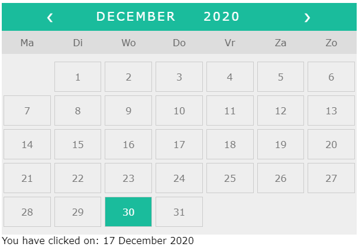

# VanillaJSmaandkalender
Created with CodeSandbox

Starting from code by Cre3z (https://codesandbox.io/s/03kl637k7n)

This is a simple Month calendar built with pure (Vanilla) JavaScript, CSS and HTML.
I have adjusted for the first weekday to be a monday (as we are used to in the Netherlands), did Dutch month translations and improved by removing borders from empty days.

We are going to highlight special dates. These holidays come from a public API. You can filter on year and country like so: https://date.nager.at/api/v2/PublicHolidays/2020/NL 
